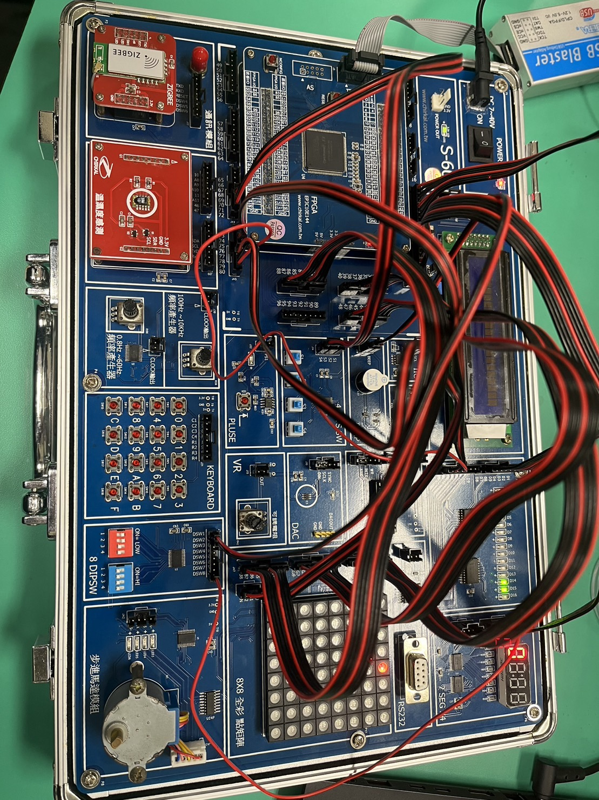

# tetris in FPGA project 
### 組員
> 111321029 莊昕珉
> 111321033 趙竟程

## 操作方式
- 4 bit switch : 左右移動、旋轉方塊、加快下落速度/重新一場新遊戲
- 8 bit  dip switch ： 暫停、自殺(直接遊戲結束)

## 顯示畫面
- 8X8 RGB 矩陣顯示遊戲畫面(遊戲結束時，顯示哭臉；暫停時，顯示笑臉)
- LED 消去行數進度條(當進度條滿時，等級加一)
- 七段顯示器顯示等級
- Beep 成功晉級時，短嗶一聲；遊戲結束時，長嗶一聲

## Pins Assignment
| To        | Value    |
| --------- | -------- |
CLK|	PIN_22
level[0]|	PIN_38
level[1]|	PIN_39
level[2]|	PIN_42
level[3]|	PIN_43
level[4]|	PIN_44
level[5]|	PIN_46
level[6]|	PIN_49
level[7]|	PIN_50
seg[0]|	PIN_51
seg[1]|	PIN_52
seg[2]|	PIN_53
seg[3]|	PIN_54
seg[4]|	PIN_55
seg[5]|	PIN_58
seg[6]|	PIN_59
DATA_R[0]|	PIN_64
DATA_R[1]|	PIN_65
DATA_R[2]|	PIN_66
DATA_R[3]|	PIN_67
DATA_R[4]|	PIN_68
DATA_R[5]|	PIN_69
DATA_R[6]|	PIN_70
DATA_R[7]|	PIN_71
DATA_G[0]|	PIN_72
DATA_G[1]|	PIN_73
DATA_G[2]|	PIN_74
DATA_G[3]|	PIN_75
DATA_G[4]|	PIN_76
DATA_G[5]|	PIN_77
DATA_G[6]|	PIN_79
DATA_G[7]|	PIN_80
beep|	PIN_83
left|	PIN_115
change|	PIN_119
right|	PIN_120
down|	PIN_121
enable|	PIN_124
COMM[2]|	PIN_125
COMM[1]|	PIN_126
COMM[0]|	PIN_127
killed|	PIN_128
DATA_B[0]|	PIN_135
DATA_B[1]|	PIN_136
DATA_B[2]|	PIN_137
DATA_B[3]|	PIN_138
DATA_B[4]|	PIN_141
DATA_B[5]|	PIN_142
DATA_B[6]|	PIN_143
DATA_B[7]|	PIN_144

